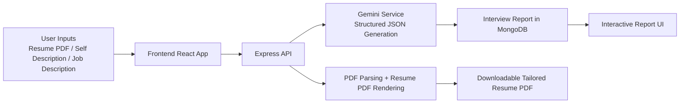

# GeniAI Interview Coach


[](https://react.dev/)
[](https://vite.dev/)
[](https://expressjs.com/)
[](https://www.mongodb.com/)
[](https://ai.google.dev/)

## Project Overview

GeniAI Interview Coach is a full-stack web application that helps candidates prepare for interviews with practical, role-focused guidance.

It combines:
- Resume context extraction (including PDF upload)
- AI-generated technical and behavioral questions
- Skill gap analysis with severity tags
- Day-wise preparation roadmap
- One-click tailored resume PDF generation

The product is designed to feel like a focused prep assistant, not a generic chatbot.

## Why This Project Stands Out

- Structured output instead of freeform AI answers (consistent, scannable, reliable)
- Interview-ready content split by intent and suggested answer strategy
- Recruiter-aware recommendations through match score + skill-gap severity
- Personalized preparation plan that can be followed day by day
- Resume generation flow tuned for readability and ATS-friendly structure

## Product Flow



## Screenshots (Ascending User Flow)

Use this order in your portfolio/demo so reviewers see a complete user journey:

1. Plan creation screen (empty state)


2. Plan creation screen (job description entered)


3. Loading state after clicking generate


4. Technical questions overview (collapsed cards)


5. Technical questions expanded (intent + model answer)


6. Behavioral questions tab


7. Loading screen for next generation cycle


Tip: put your real images in `docs/screenshots/` and replace these URLs with local links for a professional repo presentation.

## Tech Stack

### Frontend
- React 19
- Vite 7
- React Router 7
- Axios
- Sass (SCSS)

### Backend
- Node.js + Express
- MongoDB + Mongoose
- JWT auth with cookie-based sessions
- Multer for file upload
- pdf-parse for resume extraction
- Puppeteer for PDF generation
- Google Gemini via `@google/genai`
- Zod + zod-to-json-schema for response contracts

## Monorepo Structure

```text
GeniAI_FullStack_Project/
	Backend/
		server.js
		src/
			app.js
			controllers/
			routes/
			services/
			middlewares/
			model/
	Frontend/
		src/
			features/
				auth/
				interview/
```

## Local Setup

### 1) Clone and install

```bash
git clone <your-repo-url>
cd GeniAI_FullStack_Project

cd Backend
npm install

cd ../Frontend
npm install
```

### 2) Configure environment variables

Create `Backend/.env` with:

```env
MONGO_URI=your_mongodb_connection_string
JWT_SECRET=your_jwt_secret
GOOGLE_GENAI_API_KEY=your_google_genai_key
```

### 3) Run development servers

Terminal 1:
```bash
cd Backend
npm run dev
```

Terminal 2:
```bash
cd Frontend
npm run dev
```

Frontend default: `http://localhost:5173`

Backend default: `http://localhost:3000`

## API Surface (High Level)

### Auth
- `POST /api/auth/register`
- `POST /api/auth/login`
- `GET /api/auth/logout`
- `GET /api/auth/get-me`

### Interview
- `POST /api/interview` for generating interview report
- `POST /api/interview/generate-resume` for tailored resume PDF
- `GET /api/interview` to list user reports

## Quality and Presentation Tips

- Add 2-3 real screenshots to replace placeholders
- Keep one sample Job Description in your demo script for consistency
- Show one candidate journey end-to-end instead of clicking every tab randomly
- Record a 60-second demo clip and embed GIF in this README for impact

## Future Enhancements

- Team dashboard with shared mock interview templates
- Export reports to Notion/Google Docs
- Role-specific scoring rubric (SDE, Data, Product, DevOps)
- AI feedback on spoken mock interview answers

## License

MIT (or your preferred license)
