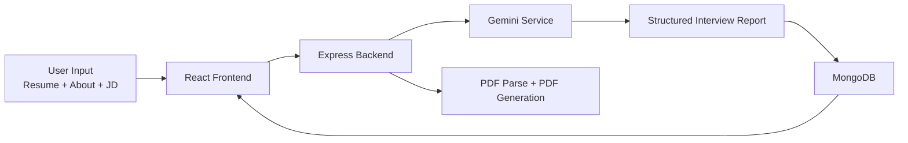
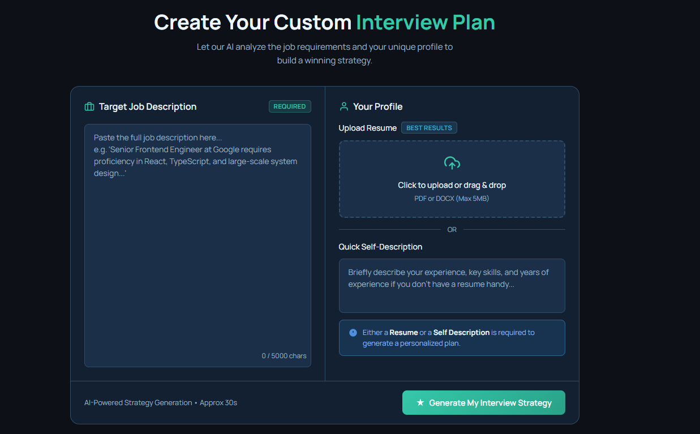
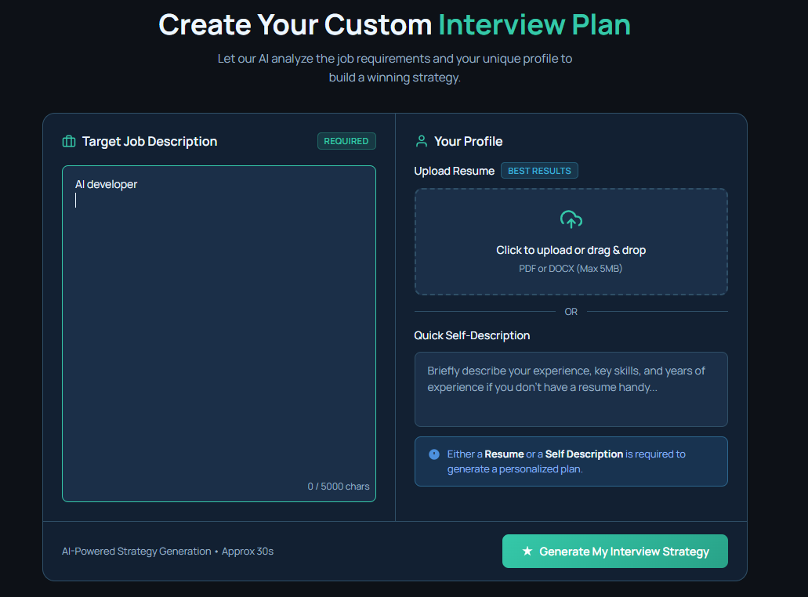
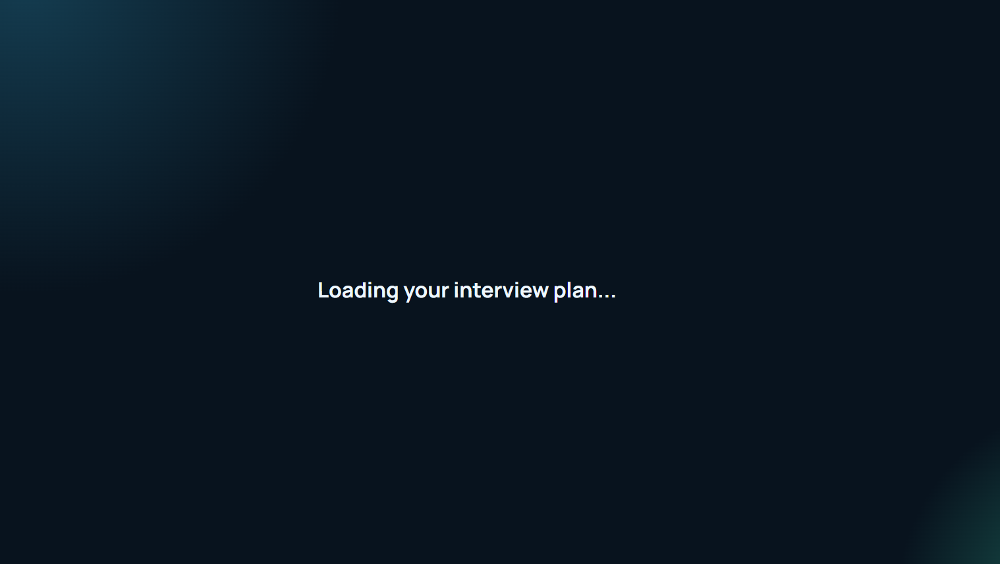
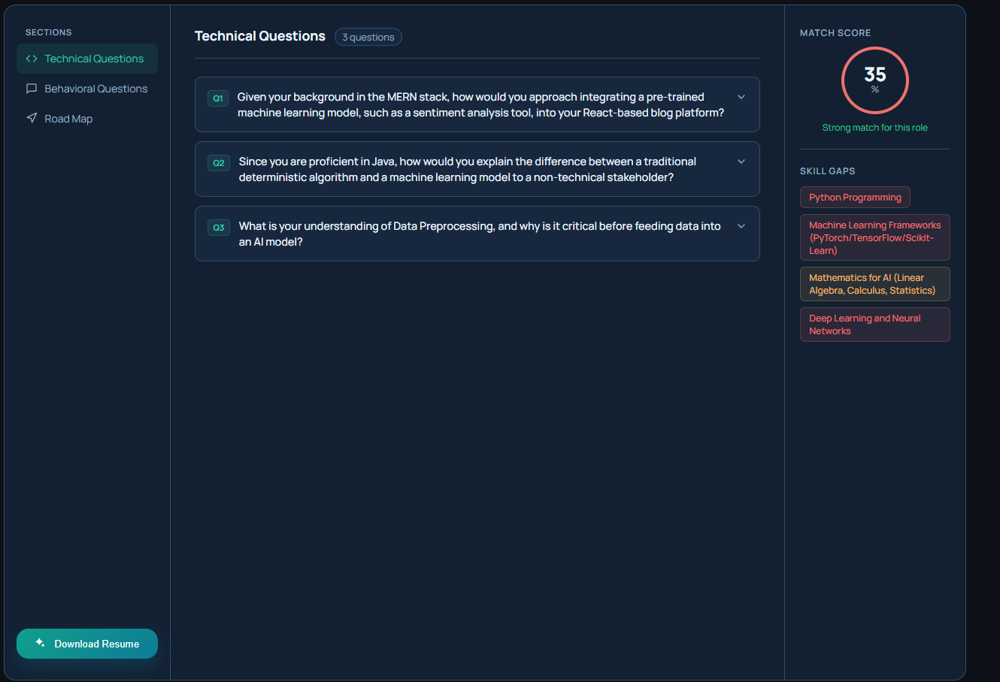
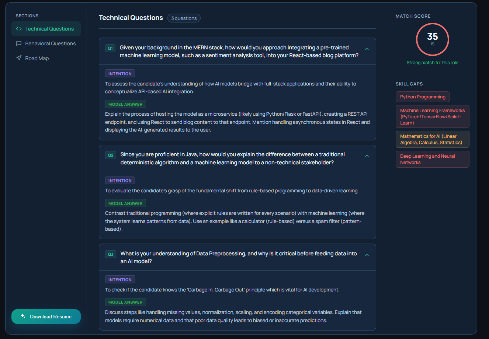
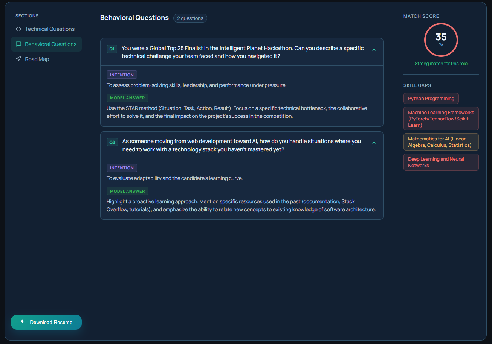
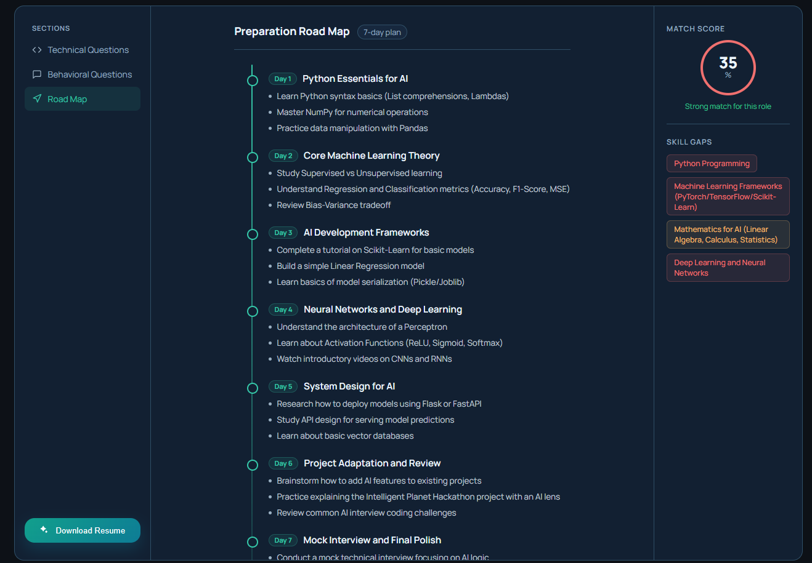
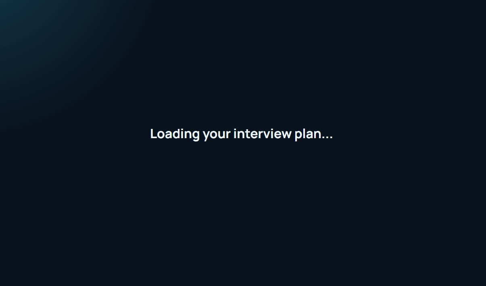
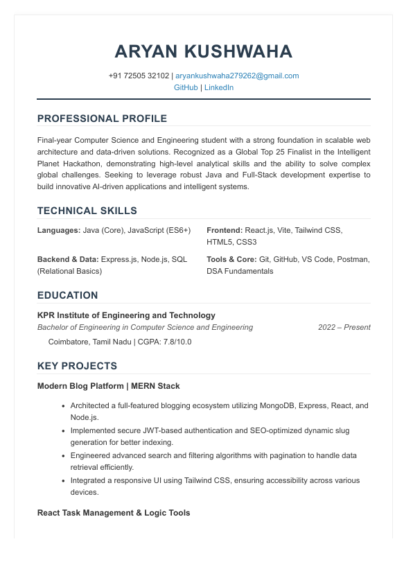

# GeniAI Interview Coach


[](https://react.dev/)
[](https://vite.dev/)
[](https://expressjs.com/)
[](https://www.mongodb.com/)
[](https://ai.google.dev/)

A full-stack AI platform to help candidates prepare better for interviews using resume analysis, role-specific questioning, skill-gap detection, and an actionable preparation roadmap.

## Highlights

- Upload resume and combine it with self-introduction + job description
- Generate structured technical and behavioral interview questions
- Get match score and skill-gap severity insights
- Build a day-wise preparation plan
- Generate a tailored resume PDF

## Architecture



## Repository Structure

```text
GeniAI_FullStack_Project/
  Backend/
    server.js
    src/
      app.js
      config/
      controllers/
      middlewares/
      model/
      routes/
      services/
  Frontend/
    src/
      features/
        auth/
        interview/
```

## Quick Start

### 1. Clone and install

```bash
git clone https://github.com/aryankushwaha007/-AI-powered-interview-preparation.git
cd -AI-powered-interview-preparation

cd Backend
npm install

cd ../Frontend
npm install
```

### 2. Configure backend environment

Create `Backend/.env`:

```env
MONGO_URI=your_mongodb_connection_string
JWT_SECRET=your_jwt_secret
GOOGLE_GENAI_API_KEY=your_google_genai_api_key
```

### 3. Run both apps

Terminal 1:

```bash
cd Backend
npm run dev
```

Terminal 2:

```bash
cd Frontend
npm run dev
```

- Frontend: http://localhost:5173
- Backend: http://localhost:3000

## API Overview

### Auth

- POST /api/auth/register
- POST /api/auth/login
- GET /api/auth/logout
- GET /api/auth/get-me

### Interview

- POST /api/interview
- POST /api/interview/generate-resume
- GET /api/interview

## Screenshots

Screenshots are listed in ascending filename order from the docs/screenshots folder:

1. Plan creation screen (empty)


2. Plan creation screen (input filled)


3. Loading state


4. Technical questions (collapsed)


5. Technical questions (expanded)


6. Behavioral questions view


7. Loading screen for next generation cycle


8. Additional view 8


9. Additional view 9



## Documentation

- Frontend details: [Frontend/README.md](Frontend/README.md)
- Backend docs can be added in: [Backend](Backend)

## Security Note


Already ignored:

- .env
- .env.*
- node_modules
